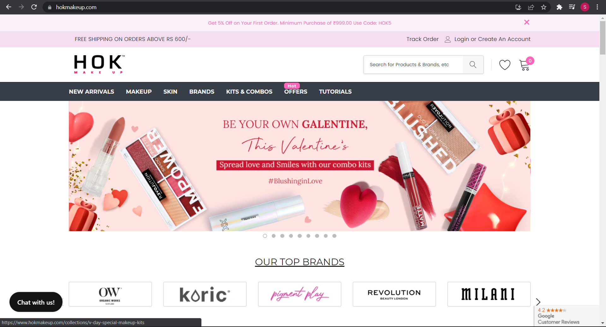
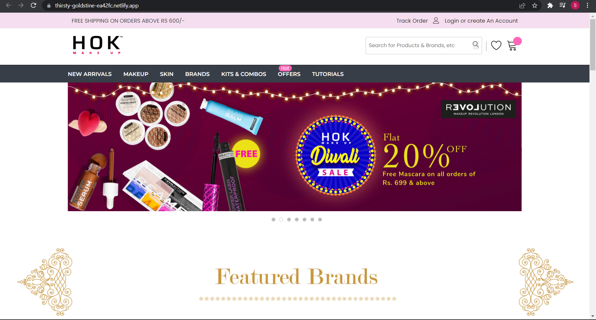
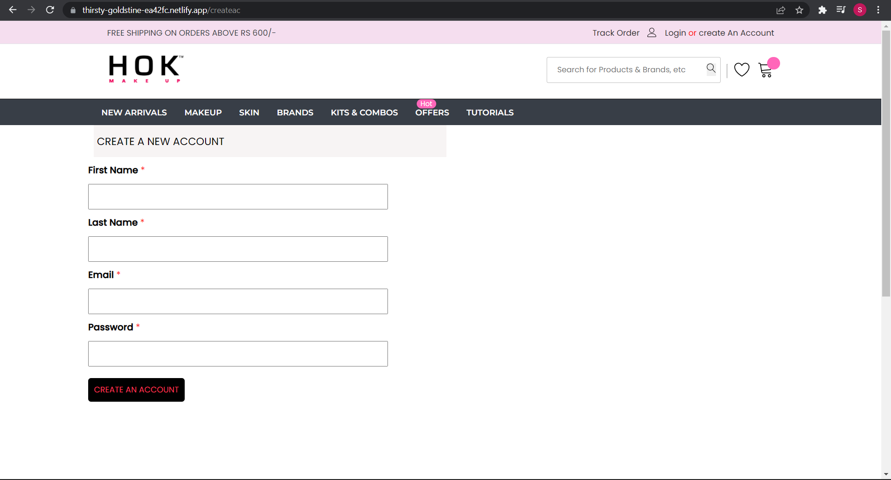
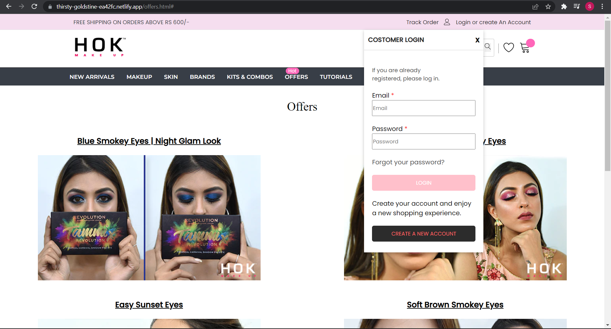
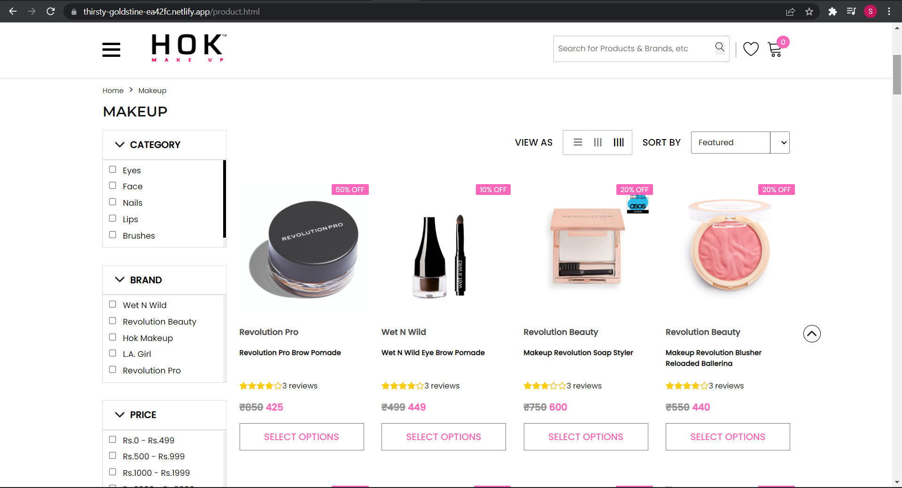
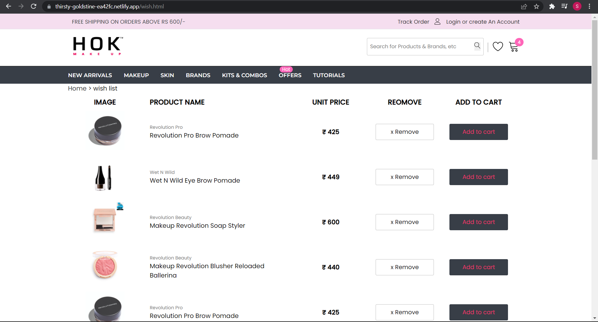
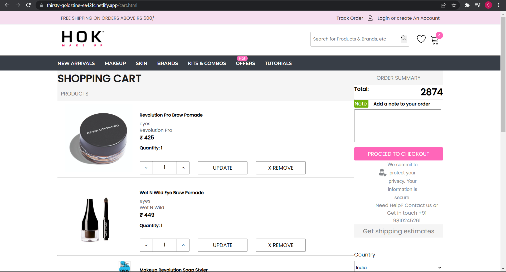
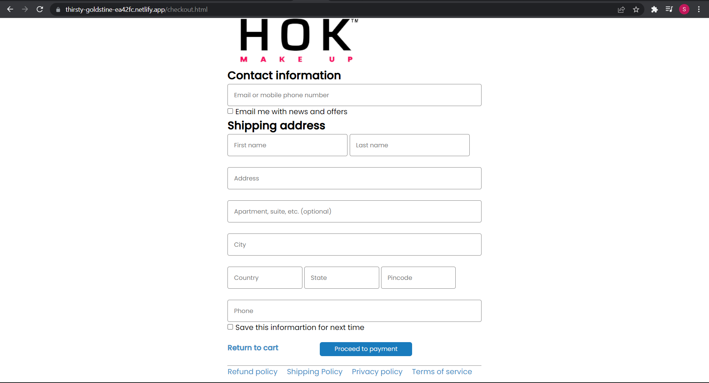
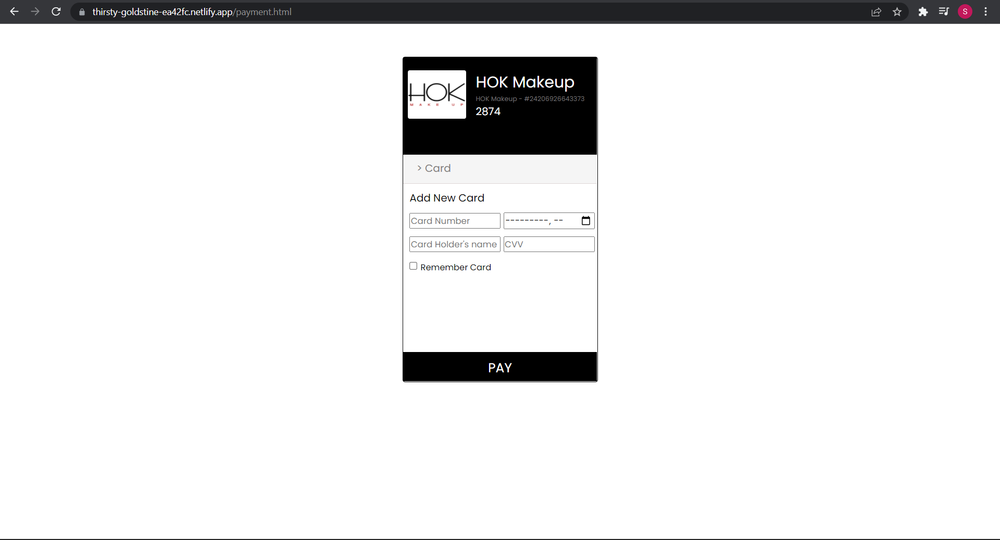

# HOK MAKEUP-CLONE  

This project is made for educational purpose only.

**Project Link -** [HOK MAKEUP-CLONE](https://thirsty-goldstine-ea42fc.netlify.app/)

## About Us

We are from Masai School, in the course of the second unit, we learned HTML and CSS.

For the second unit construct week project, Our target is to clone the Hok Makeup website. This is a collaborative project and for this we are assigned a team consisting of six members. 

## About Hok-Makeup 

Hok-Makeup is typical women makeup buying website which provides a platform where users can buy different kinds of makeup items from various brands.

## Tech-Stacks

* HTML
* CSS

## Features
 
* Product Catalogue with Sort and Filter 
* Fully Responsive Pages 
* Dynamic Cart and Wishlist Page 

## Glimpse of the project

1. Landing Page

2. Singin Page

3. Offers Page with Login Page dropdown menu

4. Products Page

5. Wishlist Page

6. Cart Page

7. Checkout Page

8. Payment Page

  
